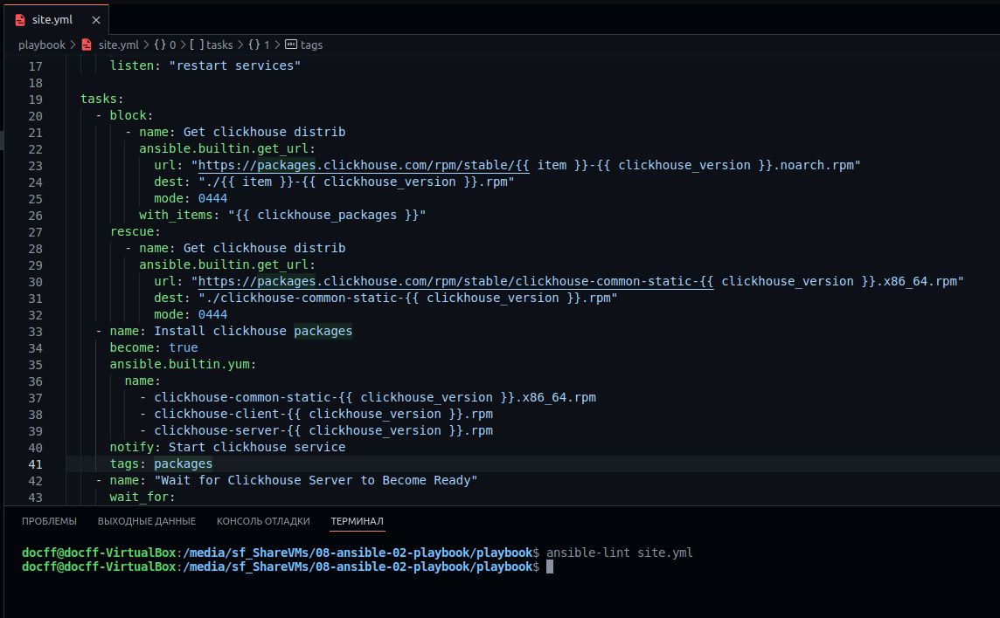

# Домашнее задание к занятию "08.02 Работа с Playbook"

## Основная часть

1. Приготовьте свой собственный inventory файл `prod.yml`.

    [prod.yml](./playbook/inventory/prod.yml)

1. Допишите playbook: нужно сделать ещё один play, который устанавливает и настраивает [vector](https://vector.dev).

    ```yml
    - name: Install Vector
        hosts: clickhouse
        tasks:
            - name: Get Vector distrib
            ansible.builtin.get_url:
                url: "https://packages.timber.io/vector/0.21.1/vector-0.21.1-1.x86_64.rpm"
                dest: "./vector-0.21.1-1.x86_64.rpm"
                mode: 0444
                validate_certs: false
            - name: Install Vector packages
            become: true
            ansible.builtin.yum:
                name:
                - vector-0.21.1-1.x86_64.rpm
            notify: Start vector service
            tags: packages
    ```

1. Вывод линтера
    

Данный playbook производит установку Clickhouse и Vector.
Подключение производится к заранее подготовленным контейнерам на базе Centos 8.

В group_vars/vars.yml Указаны пакеты для установки связанные с Clickhouse и их версии.

В плейбуке присутствуют теги: packages и create_db


---