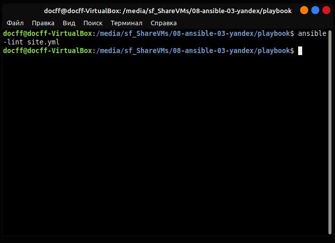

# Домашнее задание к занятию "08.03 Использование Yandex Cloud"

## Основная часть

1. Запустите `ansible-lint site.yml` и исправьте ошибки, если они есть.
    

1. Подготовьте README.md файл по своему playbook. В нём должно быть описано: что делает playbook, какие у него есть параметры и теги.

Данный `playbook` разварачивает БД `clickhouse` на облачных ВМ в качестве веб GUI выступает `lighthouse` на отдельнной ВМ.
Сбор данных производится с удаленных хостов с помощью `vector`.

В `group_vars` описаны версии пакетов и ссылки для загрузки.
В `template` расположены шаблоны конфигов.

---

*Готовый playbook выложите в свой репозиторий, поставьте тег `08-ansible-03-yandex` на фиксирующий коммит, в ответ предоставьте ссылку на него.*

---

